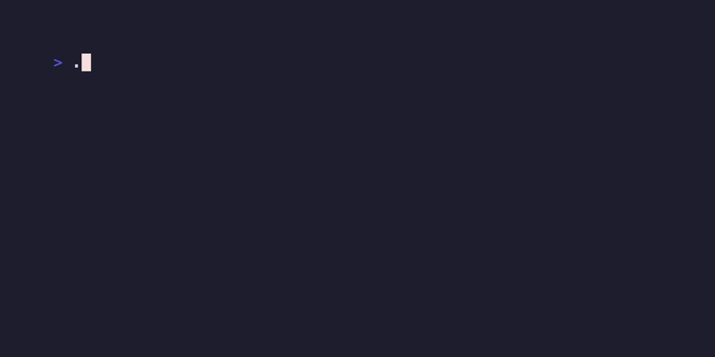
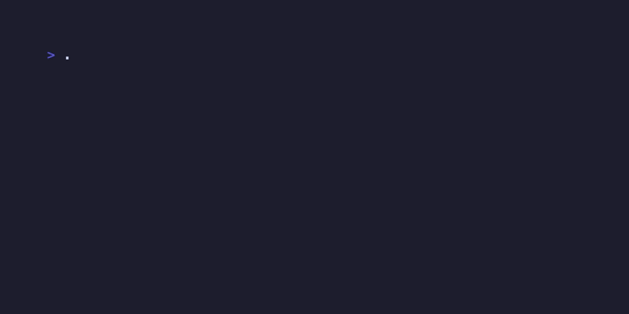

<p align="center">
  
</p>

<h1 align="center">🎨 TermGFX</h1>

<p align="center">
  <strong>Beautiful Terminal Graphics for CLI Applications</strong><br>
  <em>Styled boxes, charts, images, spinners, and interactive prompts - all in one blazing fast Rust CLI</em>
</p>

<p align="center">
  <a href="https://crates.io/crates/termgfx"></a>
  <a href="https://github.com/ybouhjira/termgfx"></a>
  <a href="https://github.com/ybouhjira/termgfx/blob/main/LICENSE"></a>
  <a href="https://github.com/ybouhjira/termgfx"></a>
</p>

---

## 🎬 See It In Action

<table>
<tr>
<td width="50%">

### 📦 Styled Boxes


```bash
termgfx box "Success!" --style success
termgfx box "Warning!" --style warning
termgfx box "Error!" --style danger
```

</td>
<td width="50%">

### 📊 Charts & Graphs


```bash
termgfx chart bar --data "A:85,B:70,C:92"
termgfx chart line --data "1,3,5,7" --animate
termgfx chart pie --data "X:45,Y:35,Z:20"
```

</td>
</tr>
<tr>
<td width="50%">

### ⏳ Progress & Spinners


```bash
termgfx progress 75 --style gradient
termgfx spinner "Loading..." --style dots
```

</td>
<td width="50%">

### ✨ More Features


```bash
termgfx sparkline "1,4,2,8,5,7"
termgfx gauge 75 --label "CPU"
termgfx table --headers "A,B" --rows "1,2"
termgfx banner "HELLO" --gradient cyan-purple
```

</td>
</tr>
</table>

---

## 🚀 Quick Start

### Installation

```bash
# From crates.io (recommended)
cargo install termgfx

# From source
git clone https://github.com/ybouhjira/termgfx
cd termgfx && cargo install --path .

# macOS (Homebrew)
brew tap ybouhjira/tap
brew install termgfx
```

### Try It Now

```bash
# Quick demos of each command
termgfx box "test" --demo
termgfx chart bar --data "a:1" --demo
termgfx progress 0 --demo
termgfx gauge 0 --demo
```

---

## ✨ Features

| Category | Commands | Highlights |
|----------|----------|------------|
| **📦 Output** | `box`, `banner`, `notification` | Styled boxes, ASCII banners, desktop alerts |
| **📊 Charts** | `chart bar/line/pie`, `sparkline`, `gauge`, `heatmap` | Animated charts, gradients |
| **📋 Data** | `table`, `tree`, `diff`, `timeline` | Tables, trees, file diffs |
| **💬 Prompts** | `input`, `select`, `confirm`, `file`, `filter`, `pager` | Interactive CLI prompts, file picker, fuzzy filter |
| **⏳ Animation** | `spinner`, `progress`, `animate` | Multiple styles, animations |
| **🖼️ Media** | `image` | Kitty, Sixel, halfblock protocols |
| **🎛️ Tools** | `dashboard`, `record`, `script` | Multi-panel dashboards |

---

## 🔥 Why TermGFX?

| Feature | TermGFX | Gum | Rich |
|---------|:-------:|:---:|:----:|
| **Charts** | ✅ bar, line, pie, sparkline | ❌ | ⚠️ limited |
| **Gauges** | ✅ | ❌ | ❌ |
| **Heatmaps** | ✅ | ❌ | ❌ |
| **Timelines** | ✅ | ❌ | ❌ |
| **Animations** | ✅ built-in | ⚠️ some | ⚠️ some |
| **Single binary** | ✅ 4.5MB | ✅ 13MB | ❌ Python |
| **CLI-first** | ✅ | ✅ | ❌ library |

---

## 📖 Command Reference

### Boxes & Banners

```bash
# Styled message boxes
termgfx box "Build passed!" --style success --border rounded
termgfx box "Warning: low memory" --style warning
termgfx box "Error occurred!" --style danger

# ASCII art banners with gradients
termgfx banner "HELLO" --gradient cyan-purple
termgfx banner "DEPLOY" --gradient red-orange
```

### Charts

```bash
# Bar chart
termgfx chart bar --data "Python:85,Go:70,Rust:95,Java:60"

# Line chart with animation
termgfx chart line --data "10,25,18,35,28,42" --title "Sales" --animate

# Pie chart with animation
termgfx chart pie --data "Desktop:45,Mobile:35,Tablet:20" --animate

# Sparkline (inline mini-chart)
termgfx sparkline "1,4,2,8,5,7,3,9,6"

# Gauge (radial indicator)
termgfx gauge 75 --label "CPU Usage" --style semicircle

# Heatmap
termgfx heatmap --data "1,2,3;4,5,6;7,8,9" --colors viridis
```

### Tables & Data

```bash
# Table from data
termgfx table --headers "Name,Age,City" --rows "Alice,30,NYC|Bob,25,LA"

# Tree structure
termgfx tree "project>src,docs>main.rs,lib.rs"

# Timeline
termgfx timeline --events "Q1:Design,Q2:Build,Q3:Test,Q4:Launch"
```

### Interactive Prompts

```bash
# Text input
termgfx input "Enter your name:"

# Single select
termgfx select "Choose OS:" "Linux" "macOS" "Windows"

# Multi-select
termgfx select "Features:" "Auth" "API" "Cache" --multi

# Confirmation
termgfx confirm "Deploy to production?"

# File picker
termgfx file --path /var --ext log,txt

# Fuzzy filter (like fzf)
ls | termgfx filter --prompt "Select:"
cat list.txt | termgfx filter --multi

# Pager (like less)
cat README.md | termgfx pager --line-numbers
```

### Progress & Animation

```bash
# Progress bars (multiple styles)
termgfx progress 75 --style gradient
termgfx progress 50 --style blocks
termgfx progress 65 --style classic

# Spinners
termgfx spinner "Loading..." --style dots --duration 5

# Typewriter effect
termgfx animate --effect-type typewriter --text "Hello World!" --duration 2
```

### Images

```bash
# Display image (auto-detects best protocol)
termgfx image ./photo.png

# Force specific protocol
termgfx image ./logo.jpg --protocol kitty
termgfx image ./chart.png --protocol sixel
termgfx image ./icon.png --protocol halfblock
```

---

## 🛠️ Shell Script Examples

### Deployment Script

```bash
#!/bin/bash

termgfx banner "DEPLOY" --gradient blue-purple

if termgfx confirm "Deploy to production?" --default no; then
    termgfx spinner "Deploying..." --duration 3 &
    # ... deployment commands ...
    wait
    termgfx box "Deployed successfully!" --style success
else
    termgfx box "Deployment cancelled" --style warning
fi
```

### Build Script with Progress

```bash
#!/bin/bash

termgfx box "Starting build..." --style info

for step in "Compile" "Test" "Package"; do
    termgfx spinner "$step..." --duration 2
done

termgfx box "Build complete!" --style success --emoji "🎉"
```

### Interactive Menu

```bash
#!/bin/bash

ACTION=$(termgfx select "What to do?" "Run tests" "Build" "Deploy" "Exit")

case "$ACTION" in
    "Run tests") npm test ;;
    "Build") npm run build ;;
    "Deploy") ./deploy.sh ;;
esac
```

---

## 🏗️ Building from Source

```bash
git clone https://github.com/ybouhjira/termgfx
cd termgfx
cargo build --release
./target/release/termgfx --help
```

**Requirements:** Rust 1.70+

---

## 📚 More Resources

- 📖 [Full Documentation](https://docs.rs/termgfx)
- 🎬 [Demo Script](scripts/v0.3.0-demo.sh) - Interactive feature showcase
- 📊 [Competitor Comparison](docs/COMPETITORS.md) - vs Gum, Rich, Plotext
- 🔧 [UX Analysis](docs/UX-ANALYSIS.md) - Design decisions

---

## 🤝 Contributing

```bash
git clone https://github.com/YOUR_USERNAME/termgfx
cd termgfx
git checkout -b feature/amazing-feature
cargo test
# Submit PR
```

---

## 📄 License

MIT License - see [LICENSE](LICENSE)

---

<p align="center">
  Made with ❤️ in Rust
</p>
